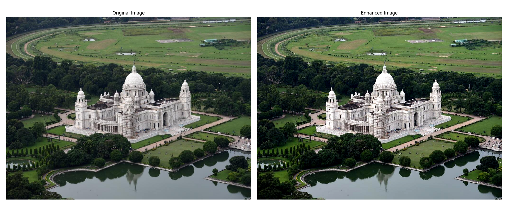
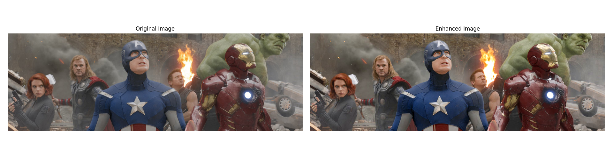

# Image Enhancement Tool

A lightweight and user-friendly Python tool designed for applying balanced image enhancements using a simple GUI-based file selector. It enables users to preview original and processed images side-by-side, making it ideal for quick visual comparisons and subtle photo improvements without overediting.

<br>

## ✨ Features

- **File Selection**: Uses a graphical dialog to select an image (JPG, JPEG, PNG).
- **Image Enhancement**:
  - Mild sharpening
  - Gentle contrast improvement
  - Subtle color enhancement (skin tones preserved)
- **Interactive Preview**: Displays original and enhanced images side-by-side using `matplotlib`.
- **Optional Save**:
  - Asks the user whether to save the enhanced image.
  - Automatically creates an `output/` folder if it doesn't exist.

<br>

## 🖥️ Demo



<br>



<br>

## 📦 Dependencies

This tool uses the following Python libraries:

| Library        | Purpose                             |
|----------------|-------------------------------------|
| `Pillow`       | Image processing and enhancements   |
| `matplotlib`   | Display images side-by-side         |
| `tkinter`      | File dialog for selecting images    |
| `os`           | Filesystem operations (creating folders) |


<br>

Install dependencies using pip:

```bash
pip install pillow matplotlib
